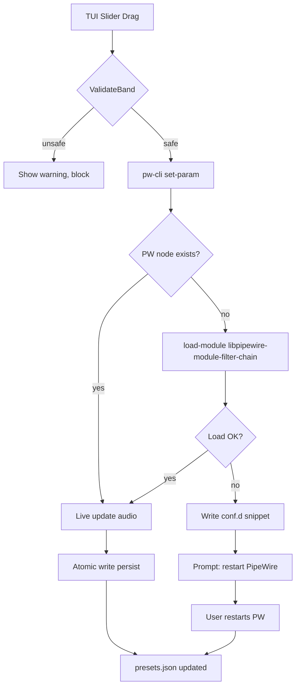

# zen-dsp v2 Architecture Plan

> Scope: Parametric EQ / DSP controller for Linux using PipeWire, no heavy Flatpak.
> Stack: Go + tview. Integration via subprocess (pw-dump, pw-cli, wpctl) only.
> Post red-team revision.

---

## 1. System Boundaries

```
┌──────────────────────────────────────────────────────────────────┐
│                       zen-dsp (Go + tview)                       │
│                                                                  │
│  ┌──────────────┐                   ┌────────────────────┐      │
│  │ Config Store │◄──── validate ───│   Filter Engine    │      │
│  │ (.conf/.apo) │                   │  (biquad chain)    │      │
│  └──────┬───────┘                   └─────────┬──────────┘      │
│         │                                     │                  │
│  ┌──────▼─────────────────────────────────────▼──────────┐     │
│  │              Transport / IPC Layer                     │     │
│  │  pw-dump (read)  │  pw-cli (load/set-param)  │ wpctl ──│     │
│  │  atomic file write                              │      │     │
│  └──────────────────────────────────────────────────────┘     │
└──────────────────────────────────────────────────────────────────┘
```

**Hard boundary**: zen-dsp does NOT process audio. It generates configuration and live-controls parameters on PipeWire's `filter-chain` module.

**Why**: Avoids real-time DSP thread, lock-free queues, and brings-your-own-runtime issues. Subprocess IPC adds installation complexity, so we delegate audio graph to PipeWire itself.

**Revision rationale**: Original v1 assumed conf.d-only + full restart. Revised to use `set-param` for live preview and `load-module` for topology, with conf.d only for persistence/auto-start.

---

## 2. Data Model

```pseudocode
struct Preset {
    name: string
    filters[]: Band
    preamp_db: float
    sr_hz: uint32           // sample rate (48000 or 96000 typical)
    source: "user" | "autoeq" | "apo"
}

struct Band {
    index: uint8
    type: FilterType
    freq_hz: float          // 20 .. 20000
    gain_db: float          // -24 .. +24
    q: float                // 0.1 .. 20.0 (lowercase q per SPA)
}

enum FilterType {
    bq_lowshelf
    bq_highshelf
    bq_lowpass
    bq_highpass
    bq_peaking
    bq_notch
    bq_bandpass
    bq_allpass
}
```

**SPA-JSON / filter-chain format** (verified against libpipewire-module-filter-chain):

```pseudocode
format_filter_chain_json(preset) -> object {
    "type": "api.alsa",
    "factory": "filter-chain",
    "stream.props": {
        "filter.chain": [
            "lavfi.aveq.num_filters=" + len(preset.filters),
            "lavfi.aveq.preamp=" + preset.preamp_db,
        ].concat(
            preset.filters.map(lambda b:
                "lavfi.aveq.filter_" + b.index +
                "=" + b.type + ":" + b.freq_hz + ":" + b.q + ":" + b.gain_db
            )
        )
    }
}
```

**Key points**:
- The `lavfi.aveq.*` property strings are the actual schema.
- `q` is lowercase in the wire format.
- Filter types use LADSPA-style `bq_*` labels.
- There is no FIR-specific type; biquads are the native chain format.

**Validation (pre-write)**:

```pseudocode
func ValidateBand(b Band, sr_hz uint32) -> []Warning {
    warnings := []
    nyquist := sr_hz / 2

    // Stability guard: very high Q near Nyquist self-oscillates
    q_limit := (b.freq_hz / (nyquist - b.freq_hz)).clamp(0, 20)
    if b.q > q_limit {
        warnings.push(Warning{
            severity: "error",
            message: "Q=" + b.q + " exceeds stability limit at " + b.freq_hz + "Hz for " + sr_hz + "Hz SR"
        })
    }

    if b.freq_hz < 20 or b.freq_hz > nyquist {
        warnings.push(Warning{...out of range...})
    }

    return warnings
}
```

**Tradeoff**: Using a flat string list for `filter.chain` keeps SPA-JSON simple but is brittle to schema changes. Alternative: structured JSON array of objects. Rejected because current PipeWire expects the flat string form.

---

## 3. TUI Layout

```
┌─── zen-dsp ─────────────────────────────────────────────────────┐
│ Preset: [Flat] [Rock] [Jazz] [+Add]                              │
│                                                                  │
│ ┌──────────────────────────────────────────────────────────────┐ │
│ │ EQ Graph                                                      │ │
│ │  +6 ┤            ╱╲                                          │ │
│ │   0 ┤───────────╱──╲────────────╲──╱─────────                 │ │
│ │  -6 ┤                                        ╲──╱            │ │
│ │     20   50  100  200  500  1k  2k  5k  10k  20k            │ │
│ └──────────────────────────────────────────────────────────────┘ │
│ [1] bq_peaking   1000 Hz   +6.0 dB   Q 1.40                    │
│ [2] bq_lowshelf   200 Hz   +3.0 dB   Q 1.00                    │
│ [3] bq_peaking   2500 Hz   -2.0 dB   Q 2.20                    │
│                                                                  │
│ Controls (esdf on selected band):                                │
│   e / d   gain + / -                                             │
│   s / f   freq + / -                                             │
│   w / r   Q + / -                                                │
│   Tab     cycle filter type                                      │
│   j / k   select band                                            │
│   :w      save preset (atomic write)                             │
│   :x      apply preset (live + persist)                          │
│   :r      reset to flat                                          │
│                                                                  │
│ Mode: TUI   SR: 48000   PW: detected   Sink: zen-dsp.eq         │
└──────────────────────────────────────────────────────────────────┘

[WARN] Band 3 Q exceeds stability limit at 2500Hz / 48000Hz SR
```

**Key binding philosophy**: Same esdf + vim save. Added `:x` for apply (live) vs `:w` for persist only.

---

## 4. Execution Flows

### 4.1 Apply Preset (Live + Persist)

```pseudocode
func ApplyPresetLive(preset Preset) -> []Error {
    // 1. Validate all bands for current sample rate
    sr, err := detect_current_sample_rate()
    if err != return [ErrPipeWireDown]

    for band in preset.filters {
        warnings := ValidateBand(band, sr)
        if warnings.has_errors() return warnings.map(to_error)
    }

    // 2. Ensure filter-chain module is loaded and get node ID
    eq_node_id, err := EnsureFilterChainLoaded(preset)
    if err != return [err]

    // 3. Live update parameters (no restart)
    for band in preset.filters {
        err := pw_cli_set_param(eq_node_id,
            "libpipewire.filter-chain.Filter." + band.index + "/Freq",
            band.freq_hz)
        // repeat for Q and Gain
        if err != return [err]
    }

    // 4. Set preamp param similarly

    // 5. Persist to conf.d for next boot
    err := atomic_write_persist(preset)
    return []
}
```

**Revision rationale**: v1 rejected live-update as "risky." Correct mechanism is `set-param` on an existing node's control ports, not module load/unload. No restart, no pops.

### 4.2 Ensure Filter Chain Loaded

```pseudocode
func EnsureFilterChainLoaded(preset Preset) -> (node_id uint32, err error) {
    // A. Check if our node already exists
    existing := pw_dump_find_node_by_name("zen-dsp.eq")
    if existing != 0:
        return existing, nil

    // B. Try runtime load into system daemon
    node_id, err := pw_cli_load_module("libpipewire-module-filter-chain",
        "capture.props={...}", "playback.props={...}")
    if err != nil {
        // C. Runtime load failed — write conf.d, prompt restart
        err2 := write_conf_d_snippet(preset)
        if err2 != nil return 0, CompositeError(err, err2)
        return 0, UserActionRequired("Restart PipeWire or run: systemctl --user restart pipewire")
}
```

**Alternative considered**: Spawn standalone `pipewire -c filter-chain.conf` as child process.
**Rejected**: PID 1-style subprocess management, D-Bus/XDG_RUNTIME_DIR propagation, and two runtime directories fighting over default sink. Module load is simpler if available.

**Fallback**: conf.d snippet with documented restart requirement. This is the "boring safe path."

### 4.3 Node Discovery & Stability

```pseudocode
func DiscoverOurNode() (uint32, error) {
    nodes := pw_dump_parse(exec_subprocess("pw-dump"))

    target := nodes.find(n -> n.name == "zen-dsp.eq")
    if target == null:
        return 0, ErrNodeNotFound

    return target.id, nil
}

func DetectSampleRate() (uint32, error) {
    nodes := pw_dump_parse(...)
    // Prefer our sink's rate; fallback to default sink
    eq := nodes.find_zen_dsp_eq()
    return eq.rate, nil
}
```

**TOCTOU mitigation**: `pw-dump` snapshot is valid for ~100ms. Any mutation that depends on node ID should re-verify existence before issuing `pw-cli` commands. If node ID changed, re-resolve.

**Naming convention**: `node.name == "zen-dsp.eq"` is stable across reconnects because it's a property of the filter-chain factory arguments, not an auto-assigned ID.

**Alternative considered**: Match by description or ALSA device.
**Rejected**: Description is localized and ALSA device path churns with USB events.

**Schema drift mitigation**: Parse `pw-dump` by key path, not ordinal index. Detect top-level `version` or schema hints; fail fast with message rather than nil-dereference.

```pseudocode
func pw_dump_parse(json string) -> []Node {
    var raw []interface{}
    json.Unmarshal(&raw)  // use stdlib, no external

    // Guard for truncated/mid-restart dumps
    if raw == nil or len(raw) == 0:
        return []Node{}

    // Detect PipeWire version field
    if raw[0]["id"] != 0:   // PW dumps always start with id=0 registry
        return error(ErrInvalidDump)

    ...
}
```

---

## 5. Routing & Default Sink

Audio routing is a first-class concern, not an afterthought.

```pseudocode
func MakeZenEQDefaultSink() -> error {
    sinks := wpctl_get_sinks()
    target := sinks.find(s -> s.name == "zen-dsp.eq")
    if target == nil:
        return ErrSinkNotPresent

    current := wpctl_get_default_sink()
    if current == target.name:
        return nil  // already default

    // Ask user via TUI dialog; non-default means audio cuts briefly
    confirmed := app.Confirm("Switch system audio to zen-dsp.eq?")
    if !confirmed: return ErrUserCancelled

    wpctl_set_default_sink(target.id)
    return nil
}

func MakeZenEQVisible() -> error {
    // If EQ sink is not the default, apps may not autoconnect automatically.
    // Offer to either:
    //   (a) make it default, or
    //   (b) move selected app to it via wpctl
    return nil
}
```

**Tradeoff**: Auto-switching default sink can surprise the user. We require explicit confirmation in the TUI, and we record the previous default to restore on demand.

**Revision rationale**: v1 was silent on this gap. Without routing, the EQ exists but is unused.

---

## 6. Subprocess Communication Contract

| Subprocess | Use | Notes |
|------------|-----|-------|
| `pw-dump` | Stage discovery, sample rate, node ID | Parse JSON; handle empty/partial output |
| `pw-cli` | `load-module`, `set-param` | Subprocess per invocation; no persistent connection |
| `wpctl` | Sink enumeration, default sink, volume | Simpler than parsing pw-dump for routing |
| `pipewire` | Conf.d reload (manual; not called directly) | User invoked or systemctl |

**Rationale against CGO**: Static binary, simpler packaging, no GObject dependency.

**Revision rationale**: Added `set-param` to pw-cli's mandate. Added schema-version guard on pw-dump.

---

## 7. Configuration File Layout

```
$XDG_CONFIG_HOME/pipewire/pipewire.conf.d/
└── 99-zen-dsp.conf               # auto-loaded on PipeWire start

$XDG_CONFIG_HOME/zen-dsp/
├── presets.json                   # user presets (case list)
├── current.conf                   # last-applied filter chain (text)
└── keymap.toml

$XDG_RUNTIME_DIR/zen-dsp/
└── running.conf                   # in-use filter chain for subprocess ref
```

**Atomic write pattern**:

```pseudocode
func atomic_write(path, content string) -> error {
    tmp := path + ".tmp." + rand_string(6)
    write_file(tmp, content)
    fsync(tmp)
    rename(tmp, path)   // POSIX atomic
}
```

**File locking**: Use `flock` advisory lock on `presets.json` to prevent concurrent zen-dsp instances from corrupting it.

---

## 8. Concurrency Model

```
Main Thread (tview):
    ├── Input capture (keypresses)
    ├── UI rendering
    ├── State mutations (serialized)
    └── QueueUpdate from background worker

Background Worker:
    ├── pw-dump polling (event-driven preferred, fallback to 5s tick)
    ├── HTTP fetch (AutoEQ)
    └── All writes to disk are serialized back through main thread
        via channel: mutations <- worker
```

**Key rule**: All state mutation happens in the main goroutine. Background goroutine produces *proposed* mutations on a channel. Main goroutine selects between UI events and proposal events.

**Cancellation**: On TUI exit, close a `done` channel. Background worker drains or aborts in-flight HTTP before exiting.

```pseudocode
ch := make(chan Mutation, 16)
done := make(chan struct{})

go func() {
    for {
        select {
        case m := <-ch:
            apply(m)     // runs on main goroutine
        case <-done:
            return
        }
    }
}()
```

**Alternative considered**: Multiple writers, mutex-shared state.
**Rejected**: tview is not thread-safe; cross-goroutine UI updates will corrupt display.

**Alternative considered**: All async I/O in background, no serialization.
**Rejected**: Races with undo ring buffer and dirty flag.

**Revision rationale**: v1 had no shutdown/cancel story and vague async save races.

---

## 9. Failure Modes

### 9.1 pw-dump partial or empty
**Trigger**: PipeWire mid-restart, socket initialized but daemon not ready.
**Detection**: parse result = zero nodes, or first entry missing `id: 0`.
**Response**: Retry up to 3 times with 200ms backoff. If still empty, show "PipeWire not ready." Exit code 2.

### 9.2 Node not found when applying preset
**Trigger**: EQ sink was removed (user disabled it, USB device churn).
**Response**: Offer to recreate via `pw-cli load-module` or write conf.d snippet.

### 9.3 Invalid generated config rejected by PipeWire
**Trigger**: Q/freq combination produces unparseable `lavfi.aveq.filter_N=` string.
**Detection**: `set-param` or module load returns error.
**Response**: Rollback to previous backed-up preset. Show error string.

### 9.4 Write failure to XDG dir
**Trigger**: Config dir is read-only (immutable rootfs, flatpak sandbox).
**Response**: Save to `$XDG_RUNTIME_DIR/zen-dsp-backup.conf`. Warn user.

### 9.5 Sample rate mismatch
**Trigger**: User changes default sink to device with different SR, invalidating cached biquad coefficients (rare: biquads are SR-agnostic but Q/freq limits change).
**Response**: Re-validate on next pw-dump poll; flag stale preset.

### 9.6 Route failure
**Trigger**: `wpctl set-default` fails with permission or sink vanished.
**Response**: Do not persist; show manual routing instructions.

---

## 10. Routing Gap — Topology Invariants

Signal path for EQ to be audible:

```
App Streams  ──►  PipeWire Router  ──►  zen-dsp.eq (virtual sink)  ──►  ALSA
                      ▲
                 default-sink
```

**Invariant 1**: A virtual sink `zen-dsp.eq` must exist.
**Generation**: `pw-cli load-module libpipewire-module-filter-chain` with `playback.props = { node.name = "zen-dsp.eq" }`, OR manual conf.d entry.

**Invariant 2**: `zen-dsp.eq` must be the system default sink.
**Enforcement**: `wpctl set-default <id-of-zen-dsp.eq>`.

**Invariant 3**: The physical device targeted by `zen-dsp.eq` must be the user's actual speakers.
**Configuration**: filter-chain module's `target.object` or ALSA device property. Default to system default at load time.

**Missing in v1**: Invariants 2 and 3 were never specified. Without them, the EQ exists but is unused.

---

## 11. State Management

- **Canonical state**: single in-memory `Preset`.
- **Disk is a derived artifact**: presets.json is written on save, read on init.
- **Undo**: ring buffer of last 64 states (each state is a full Preset snapshot). Deep-copy on each boundary mutation.
- **Dirty flag**: set on any mutation. `:q` prompts if dirty. `:w` clears flag.
- **Persistence format**: `presets.json` is a JSON array. Each preset's `filters` is an array of `Band` structs.

---

## 12. Concurrency Summary

| Actor | Parallelism | Safety Mechanism |
|-------|-------------|------------------|
| tview main goroutine | UI + mutations | Single-threaded by design |
| Background worker | pw-dump poll, HTTP fetch | Channel to main goroutine |
| Async save | Serialized to main goroutine | No direct file writes from bg |
| Undo thread | N/A — undo is synchronous | — |

**No shared mutable state across goroutines**.

---

## 13. Build & Distribution

```makefile
build:
    go build -ldflags="-s -w" -o zen-dsp ./cmd/zen-dsp/

install:
    install -Dm755 zen-dsp $(DESTDIR)/usr/local/bin/zen-dsp
    install -Dm644 pkg/desktop/zen-dsp.desktop $(DESTDIR)/usr/share/applications/

package-deb:
    equivs-build control
    dpkg -i ../zen-dsp_*.deb
```

**Distribution**: Static ELF binary. No container, no runtime beyond libc + PipeWire utils.

**Alternative rejected**: Flatpak (explicitly out of scope per requirement).

---

## 14. Nix / Cross-Distro Build

```nix
{ pkgs ? import <nixpkgs> {} }:

pkgs.buildGoModule {
  pname = "zen-dsp";
  version = "0.1.0";
  src = ./.;
  vendorHash = "sha256-AAAA";
  proxyHook = pkgs.lib.mkIf (pkgs.stdenv.hostPlatform.isLinux) {
    buildInputs = [ pkgs.makeWrapper ];
    postInstall = ''
      wrapProgram $out/bin/zen-dsp \
        --suffix PATH : ${pkgs.lib.makeBinPath [ pkgs.pipewire pkgs.wireplumber ]}
    '';
  };
}
```

**Why**: Go subprocess approach keeps runtime dependency minimal; the wrapper only needs `pw-dump`, `pw-cli`, and `wpctl` in PATH.

**Alternative considered**: Rust (as andyyu's upstream).
**Rejected**: User asked for Go. Go's stdlib JSON and tview ecosystem is mature enough.

---

## 15. Testing Strategy

### Unit (no PipeWire)
- Parse/round-trip `lavfi.aveq.*` string generation
- `LogFrequencyMap` transformation
- `ValidateBand` boundary cases
- `.apo` / `.conf` importers
- atomic_write crash-safety verify via temp file inspection

### Integration (requires PipeWire runtime)
- `pw-dump` parse smoke test ( Golden JSON snapshot )
- `pw-cli set-param` round-trip: write param, read back via `pw-dump`
- `wpctl` sink enumeration and default-switch

### CI Setup
CI jobs must provide a PipeWire session:
```bash
# Minimal user session
export XDG_RUNTIME_DIR=/tmp/xdg-runtime-$$
mkdir -p $XDG_RUNTIME_DIR
pipewire -c none -n pipewire &
WPID=$!
sleep 2
# Run tests
go test ./...
kill $WPID
```

**Alternative considered**: Mock all subprocess.
**Rejected for integration**: Schema mismatches between mock and real `pw-dump` are the dominant failure mode; end-to-end catches them.

---

## 16. Open Questions (post-revision)

| # | Question | Confidence | Next Action |
|---|----------|------------|-------------|
| 1 | Does `pw-cli load-module` work against the running user daemon on all major distros? | 70% | Test on Arch, Fedora, Debian stable. |
| 2 | Is `set-param` latency acceptable for interactive TUI slider response? | 85% | Subprocess invocation cost ~2-5ms; acceptable per keypress. |
| 3 | Can `wpctl set-default` be called repeatedly without side effects? | 90% | Generally safe; one confirmation per session caches. |
| 4 | Is `lavfi.aveq.filter_N` format stable across PipeWire 1.0+ minor releases? | 75% | Inspect `spa-json` docs and module source. |

---

## 17. Risk Register (v2)

| Risk | Likelihood | Impact | Mitigation |
|------|------------|--------|------------|
| `pw-cli load-module` fails silently | Medium | High | Fallback to conf.d snippet + restart prompt |
| Full audio stack interruption | **High** (if using conf.d restart) | **High** | Primary path is `set-param` live update; restart only on explicit user request |
| Node name collision (`zen-dsp.eq`) | Low | Medium | Document name; offer `--name` flag |
| Q/freq self-oscillation from bad preset import | Medium | High | Pre-write validation; reject unsafe combos |
| Node ID churn on hardware reconnect | High | Medium | Resolution by `node.name`, not ID; re-resolve before every `set-param` |
| `pw-dump` empty/truncated mid-restart | Medium | Medium | Retry with backoff; detect missing registry entry |
| `wpctl` permission failure (sandbox) | Low | Medium | Fallback: print wpctl command for manual run |
| SPA-JSON property schema drift | Medium | High | Pin to auditable `lavfi.*` flat-string format; unit test generation |
| Two zen-dsp instances racing on presets.json | Low | Low | `flock` on presets.json read/write |

---

## 18. Pseudocode: Main Entry

```pseudocode
func main() {
    ctx := app.New()
    defer shutdown_worker()

    preset := NewFlatPreset(48000)
    state := AppState{
        preset:    preset,
        dirty:     false,
        pw_ok:     check_pipewire(),
        eq_loaded: false,
        eq_node:   0,
    }

    // Wire background worker -> main mutation channel
    mutations := make(chan Mutation, 16)
    done := make(chan struct{})
    go background_worker(pw_dump_poll, mutations, done)

    // Process proposals from worker on main thread
    ctx.SetAfterDraw(func() {
        select {
        case m := <-mutations:
            apply_mutation(&state, m)
        default:
        }
    })

    ctx.SetInputCapture(func(event *tcell.EventKey) *tcell.EventKey {
        switch event.Rune() {
        case 'e': adjust_gain(&state, +1)
        case 'd': adjust_gain(&state, -1)
        case 's': adjust_freq(&state, -1)
        case 'f': adjust_freq(&state, +1)
        case 'w': adjust_q(&state, -1)
        case 'r': adjust_q(&state, +1)
        case 'j': select_band(&state, +1)
        case 'k': select_band(&state, -1)
        case ':': enter_command_mode(&state, mutations)
        }
        return nil
    })

    if err := ctx.SetRoot(render_ui(&state)).Run(); err != nil {
        log.Fatal(err)
    }

    close(done)
}
```

---

## 19. Implementation Order (Roadmap)

1. **Core types + validation** (`preset.Band`, `ValidateBand`).
2. **SPA-JSON writer** (`lavfi.aveq.*` flat strings).
3. **Atomic save + conf.d persistence** (`atomic_write`, file locking).
4. **pw-dump parser** (snapshot-based, empty/partial guard).
5. **PipeWire apply** (`load-module` with `zen-dsp.eq` name; fallback path).
6. **Live param update** (`set-param` via pw-cli).
7. **Router** (`wpctl` default sink flow).
8. **TUI** (graph + controls via tview).
9. **Preset I/O** (`.apo`, `.conf`, `presets.json`).
10. **AutoEQ import** (fetch text config, translate to native bands).

---

## 20. Mermaid: Topology & Apply Flow


